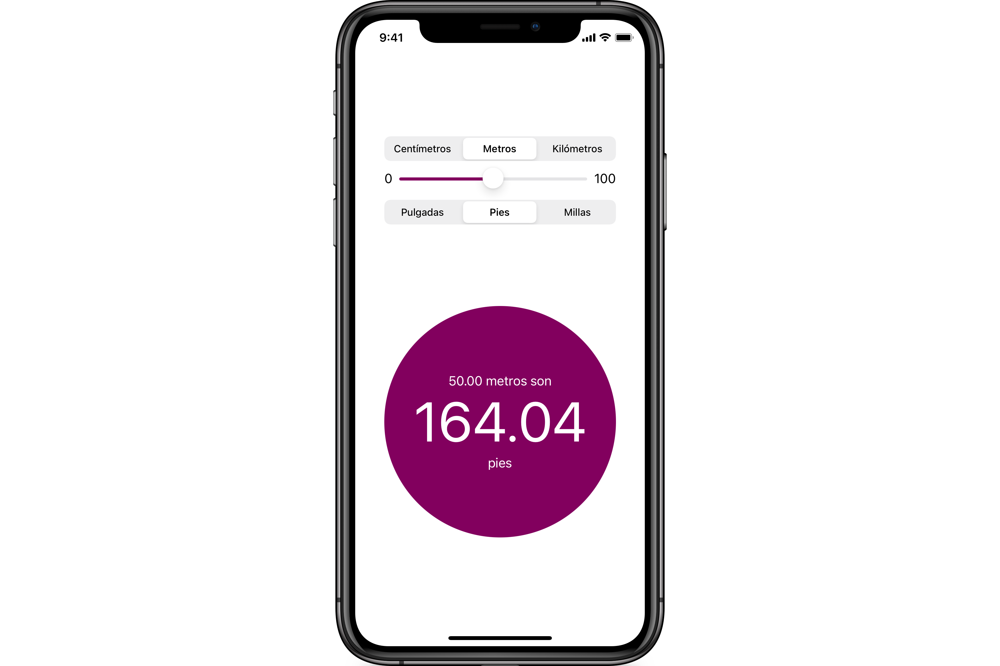

# Conversor de unidades

Crea un conversor de unidades del [Sistema Internacional](https://es.wikipedia.org/wiki/Sistema_Internacional_de_Unidades) al [sistema imperial](https://es.wikipedia.org/wiki/Sistema_anglosajón_de_unidades).

## Requisitos

El interfaz de usuario deberá tener este aspecto:

## Restricciones

Utiliza SwiftUI para crear el diseño.

Desarrolla solo la orientación en vertical.

Da soporte al modo oscuro aplicando los colores adecuados.
